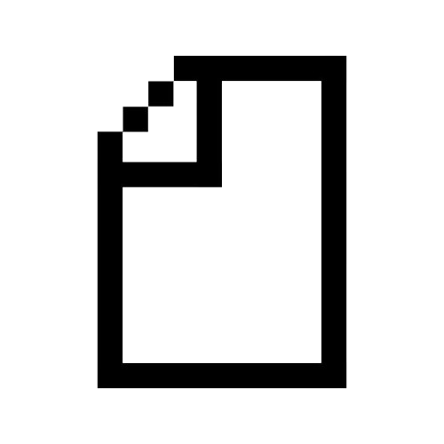
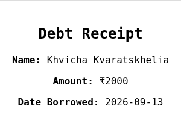
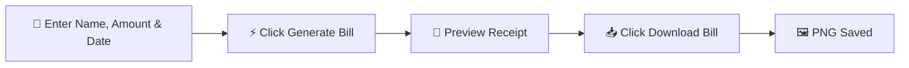

<div align="center">



# 💸 Debtly

### Remember who borrowed money and how much.

A lightweight, no-signup web app for generating clean, downloadable debt receipts.

<br/>

[](https://ankith34.github.io/Debtly/)
[](#tech-stack)
[](#tech-stack)
[](#tech-stack)
[](LICENSE)

</div>

<br/>

<div align="center">



<sub>An actual receipt generated by Debtly, downloaded as a PNG</sub>

</div>

<br/>

> [!TIP]
> Debtly runs 100% client-side — your data never leaves your browser.

---

## ✨ Overview

**Debtly** is a minimal, static web application that lets you create and download a professional-looking debt receipt in seconds — no account, no backend, no friction.

Enter a name, an amount, and a date, and Debtly generates a clean receipt you can save as an image and send to whoever owes you money. It's built for the small, everyday moment of *"I lent my friend ₹500 — I need proof of that."*

---

## 🚀 Features

<table>
<tr>
<td width="50px" align="center">⚡</td>
<td><strong>Instant Generation</strong><br/>Fill a short form and get a formatted receipt immediately</td>
</tr>
<tr>
<td align="center">🖼️</td>
<td><strong>Download as Image</strong><br/>Export the receipt as a PNG using <code>html2canvas</code></td>
</tr>
<tr>
<td align="center">🔓</td>
<td><strong>Zero Setup</strong><br/>No sign-up, no login, no database — just open and use</td>
</tr>
<tr>
<td align="center">🧱</td>
<td><strong>Fully Static</strong><br/>Pure HTML, CSS, and JavaScript — runs entirely in the browser</td>
</tr>
<tr>
<td align="center">📱</td>
<td><strong>Responsive UI</strong><br/>Works cleanly across desktop and mobile</td>
</tr>
</table>

---

## 🧭 How It Works



That's the entire flow — no accounts, no data stored, no server round-trips.

---

## 🛠️ Tech Stack

| Layer | Technology |
|---|---|
| 🏗️ Structure | HTML5 |
| 🎨 Styling | CSS3 |
| ⚙️ Logic | Vanilla JavaScript |
| 📸 Image Export | [html2canvas](https://html2canvas.hertzen.com/) |
| 🌐 Hosting | GitHub Pages |

---

## 📁 Project Structure

```
Debtly/
├── assets/         # Logo and static assets
├── index.html      # App markup and structure
├── style.css       # Styling
└── script.js       # Form logic and receipt generation
```

---

## 💻 Running Locally

No build tools or dependencies required.

```bash
git clone https://github.com/Ankith34/Debtly.git
cd Debtly
```

Then simply open `index.html` in your browser — or serve it locally:

```bash
npx serve .
```

---

## 🌍 Live Demo

Debtly is live and hosted via GitHub Pages:

<div align="center">

### 👉 [ankith34.github.io/Debtly](https://ankith34.github.io/Debtly/) 👈

</div>

---

<div align="center">

Made with 💜 by **[Ankith](https://github.com/Ankith34)**

</div>
